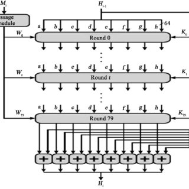

# SHA 512 Digest
***
## Keith Nolan: G00351932
***
## Project Goal
- This program calculates the SHA512 value of an input file. 
- It takes the name or path of the file as a command-line argument and outputs the SHA512 digest of it.
- This programme only runs with GCC or clang compilers

***

## This repository contains
- README.md - Describes the project and how you can set it up.
- Files Containing the preprocessing of Sha512
- The numerous functions used to execute the Sha512 hashing algorithm
- A file containing the Sha512 implementation, incorporates all of the building blocks. 
- Make File
***
## How to use this project

### Installing necessities
#### Windows
- Install **Windows** subsystem for linux. Available at: https://docs.microsoft.com/en-us/windows/wsl/install-win10

***
## How to run this project
- Download this repository from **Github**.
- Move to the project directory
- Move into 512 directory
- Make the file: make SHA512
- Run the following: ./Sha512 name or path of the file you want to digest
- Run test class (While in 512 directory)
- chmod u+x tests.sh
- Please note this application was written on a Macintosh the command for shasum isshasum -a 512 filename
- This may differ on a windows os
- Run ./tests.sh
- Enjoy
***

### About SHA512
SHA stands for "Secure Hashing Algorithm". 
These algorithms are used for hashing data and files. Hashing algorithms are implemented in multiple computing fields such as internet security digital certificates and blockchain. 
The idea behind these algorithms is that when data has been passed into a SHA function a unique hash is outputted. Changing any one of these values will result in a completely different hash being outputted. 

Sha algorithms are one-way functions. This means that you cannot decrypt the data by just looking at it. The only possible way to crack an encrypted Sha output would be by guessing and checking which is computationally expensive and may take a very long time to finish if ever. 
#### Hashing functions
Hash functions take in data as input and output a hash digest. This digest is of a fixed length.
There is a limit to the size of the message that can be hashed. 
The message format has 3 parts:

- the inputted message
- the padding of bits
- size of the inputted message

All of these elements combined should have a size of a whole multiple of 1024 bits, as the formatted message will be processed in blocks of 1024 bits. For this reason, each block needs 1024 bits. 
##### Padding
In padding bits are added to the original message, this is done to get the needed length of a message.
Zeroes are used for this with a starting 1 for example (10000000........0000000)[13].To follow the outlines laid out in the algorithm, padding needs to be implemented if the correct size is off even by 1 bit [13].
The total size value must be represented in 128 bits, that is 128 bits sort of a multiple of 1024. This is the only limitation for the size of the input message [13]. 

SHA512 processes each block of 1024 bits from the inputted message, it does this using the result from the previous block. For the first block of 1024 bits, a default value is used to start this process. 

The result from each block is stored in a hash buffer, this also holds the final digest of the whole process. 
***
\
&nbsp;
&nbsp;
<b>Sha512 Padding</b>
***

#### Message processing
As established above message processing takes place by taking each block of 1024 bits and the previous processing result. Each message block is expanded into 80 words, with each having a size of 64 bits [13].
The next part of the algorithm consists of several <b>rounds</b> [13]. Rounds take a word, the output of the previous round and a constant in this case a 512 constant. Similar to processes the first round has no previous round to input. In this case, it uses the final output from the previous message processing [13].

When the Round is given the 3 inputs that it needs it processes them and outputs a value of 512 bits [13] and is then repeated for 80 rounds [13]. When the 80 rounds have been finished the final output is added to the result of the previous <b>message</b> [13].
***
\
&nbsp;
&nbsp;
<b>Sha512 processing of a single block</b>
***

#### Output
When each block completes message processing the final 512 Hash digest is outputted [13].

#### Real world use cases for SHA2
A popular Sha function is Sha256 which belongs to SHA-2. The 256 meaning 256 bits are outputted.

If the string apple is hashed using SHA 256 the following hash is outputted in hexadecimal form which represents the string in 64 characters:

f5903f51e341a783e69ffc2d9b335048716f5f040a782a2764cd4e728b0f74d9 

If even one character in the word apple is changed SHA 256 will output a completely hash value.
Output if the word “apppe” is inputted:

61CEE41CC3562DB9E24281047B52DF792BD93F79CC4B6AC422DE0967A587DBBC

A famous use case for the Sha256 algorithm is its use case in Bitcoin. 
Bitcoin uses a Blockchain to store its transactional data. A Blockchain can be thought of as a Decentralised Distributed database. It is Distributed because it is not stored on one device or machine such as a server. Instead, all network participants hold a copy of the database and network participants validate transactions by completing Proof-Of-Work. Since there is no central authority, the network must have a way to validate transactions and counteract double-spending efforts. 

Proof-of-work is how the network reaches this consensus[2,12]. Network participants called miners[2]. Miners use their CPU to perform a mathematical problem that has a leading number of 0's [2,12]. Solving this problem is costly in terms of CPU power and electricity. Once the problem has been solved it is easy for the network to check the answer and once verified the block is added to the Blockchain permanently [2]. 

#### SHA256
Each block in the blockchain is unique and values must be generated for each block[2]. A hash for a block is generated from the data that applies to each block. This includes the timestamp, the transaction data that is unique to that block and the hash value of the previous block (last hash)[2]. Each block references the hash of the previous block. This is stored in the subsequent block as the last_hash. Meaning each block reinforces the one after it. If one hash has been changed it will poison all the subsequent blocks. The first block in a blockchain is called the genesis block. This Block is hardcoded with data as there is nothing before it. 
This is very useful when trying to ensure if a particular block is clean. If the block hash returned is different from the one that has been presented, this tells us straight away that the blocks data has been tampered with.
*** 
\
<b>Blockchain blocks</b>\
***

## Attacks on SHA

The SHA-2 algorithm has very few attacks that will work against it. With that being said one of the most common is a reduced round preimage attack [14]. This attack works if the output is equidistributed [16]. If it is then the probability of any hash starting with 0x12345678 for example is 2-32. This would mean the expected number of hashes an attacker would need to perform is 232, which is achievable[15]. But like all attacks on Sha, none of them is completely successful.

## Why is SHA-512 important
In a world where our data privacy is constantly in question, people always need ways to ensure that data of whatever kind hasn't been tampered with. One use for the Sha-2 family as mentioned above is ensuring the integrity of data in a system such as a Blockchain. 

An important feature of the Sha-512 and Sha-2 family alike is that if data has tampered with it guarantees that the data is no longer valid. This is extremely powerful. Sha is still being used in modern-day applications and still is being, which shows that it has stood the test of time. 

## Why can't we reverse the SHA512 algorithm to retrieve the original message from a hash digest?
Hash functions encrypt data using algorithms such as Sha. Unlike other encryption algorithms such as asymmetric, they don’t have a key-value pair where the receiver can decrypt the message that they have been sent. This is because the SHA algorithms are “one-way hash functions”. A variable-length plaintext message is hashed into a fixed-length hash value or message digest. After the plain text has been hashed if the hash on the plain text gets tampered with or changed, the actual plain text gets changed. This ensures integrity. 

Two inputs can have the same hash as SHA512 is random, when this happens it is called a hash collision. By design Sha makes collisions difficult to find. The only real way to reverse a hash function is by brute force in a reasonable amount of time. In SHA512 there are 2<sum>512</sum> possible hashes

## Can you design an algorithm that, given enough time, will find input messages that give each of the possible 512-bit strings?

SHA stands for secure hashing algorithm. The word secure is used as it is difficult to reverse and it is very difficult to find two given inputs that give the same output. 

Complexity of SHA-512
As we know a SHA function takes in a variable-length input. It then 
-	Pads the message. Sometimes an extra block is needed, always a fixed amount of work. 
-	Breaks it into blocks. The number of blocks is \frac{n + pad}{1024}. 
-	Each block is then processed. This is always a fixed number of operations. Doesn’t depend on n.

In other words, the complexity is of the order of n.

Complexity of inverse 
To start with there is no inverse of SHA-512. For this to be an inverse there would have to be one output for any given input. The inverse of the Sha-512 algorithm has multiple potential outputs for some input. 

To bring the hashed value back to the original text. The strings are restricted to 2128. The contained strings go from strings of length 0 to strings of the power of 21281.
This means that the complexity would be (20 + 2-1 .. + 2128-1 -1) * N
For this reason, the secure hash algorithm can never be broken as there are too many possible values for an attacker to discover in a reasonable amount of time. It can even be said that an attacker could get luckier by guessing the password than actually trying to reverse this algorithm. 

## How difficult is it to find a hash digest beginning with at least twelve zeros?
To answer this question I will use the Bitcoin example. Each block in a blockchain needs to be mined by miners for it to become a valid block in the chain [2]. When mining a block the miner needs to find the hash of the block. When mining blocks there is always a difficulty, this is how difficult it is to mine that particular block or in other words how much computing power will be needed to mine that block. The difficulty is a set value and will go up and down depending on the average block mining rate. To solve the hash for the block, a leading number of zero's must be in front of it. This is the difficulty. 
The more zeros that are needed at the beginning of the target hash the more difficult it is to solve the hash for that block. 

Adapted from [19]
A bitcoin hash is made up of 64 hexadecimal characters or 1664
If you were trying to guess this value then you would need to guess 168 times before you could find the correct value. 

Since the minimum difficulty requires 8 zero hexadecimal characters at the start of the hash. 
The probability of a hash being valid is proportional to the difficulty
. The constant being (216-1)/ (12 * 248) so that is the probability of a hash being valid. 

### Theory of Algorithms 2021 Workings

| Decimal | Hex | Binary |
|---------|-----|--------|
|       0 |   0 |   0000 |
|       1 |   1 |   0001 |
|       2 |   2 |   0010 |
|       3 |   3 |   0011 |
|       4 |   4 |   0100 |
|       5 |   5 |   0101 |
|       6 |   6 |   0110 |
|       7 |   7 |   0111 |
|       8 |   8 |   1000 |
|       9 |   9 |   1001 |
|      10 |   A |   1010 |
|      11 |   B |   1011 |
|      12 |   C |   1100 |
|      13 |   D |   1101 |
|      14 |   E |   1110 |
|      15 |   F |   1111 |

|Decimal | Hex |   Binary |
|--------|-----|----------|
|    241 |  F1 | 11110001 |
|    170 |  AA | 10101010 |\
***

### References

##### Secure hash standard:
[1] https://nvlpubs.nist.gov/nistpubs/FIPS/NIST.FIPS.180-4.pdf

##### A Peer-to-Peer Electronic Cash System (uses Sha256)
[2] Satoshi Nakamoto: Bitcoin: “A Peer-to-Peer Electronic Cash System“

##### Multi -line editing
[3] https://stackoverflow.com/questions/30037808/multiline-editing-in-visual-studio-code

##### Bitwise operations
[4] https://en.wikipedia.org/wiki/Bitwise_operations_in_C

##### Bitwise operators in C Programming
[5] https://www.programiz.com/c-programming/bitwise-operators

##### Declare 64 bit integers in C
[6] https://stackoverflow.com/questions/9606455/how-to-specify-64-bit-integers-in-c

##### Multi-line editing vscode
[7] https://kencenerelli.wordpress.com/2018/03/25/visual-studio-code-multi-line-and-multi-cursor-editing/

##### Writing endian independent code
[8] https://developer.ibm.com/technologies/systems/articles/au-endianc/

##### Byteswap
[9] https://stackoverflow.com/questions/41770887/cross-platform-definition-of-byteswap-uint64-and-byteswap-ulong

##### Unsigned 128 
[10] https://stackoverflow.com/questions/16088282/is-there-a-128-bit-integer-in-gcc

##### Command line arguments in C
[11] https://www.cprogramming.com/tutorial/c/lesson14.html

##### Evaluating Proof- of-Work Consensus Protocols
[12]  R.Zhang, B.Preneel” Lay Down the Common Metrics: Evaluating Proof- of-Work Consensus Protocols’ Security” 

##### cryptography explaining sha512
[13] https://medium.com/@zaid960928/cryptography-explaining-sha-512-ad896365a0c1

##### Reasons why SHA512 is superior to MD5
[14] https://stackoverflow.com/questions/2117732/reasons-why-sha512-is-superior-to-md5

##### SHA-512 partial preimage
[15] https://crypto.stackexchange.com/questions/25326/sha-512-partial-preimage

##### Equidistributed sequence
[16] https://en.wikipedia.org/wiki/Equidistributed_sequence

#### Fractions in markdown
[17] https://rmd4sci.njtierney.com/math

#### bitcoin core
[18] http://www.cryptoswise.com bitcoin-core-how-difficult-is-it-to-find-a-hash-digest-beginning-with-at-least-twelve-zeros/
#### What are the units of “difficulty"
[19] https://bitcoin.stackexchange.com/questions/75895/what-are-the-units-of-difficulty
***
